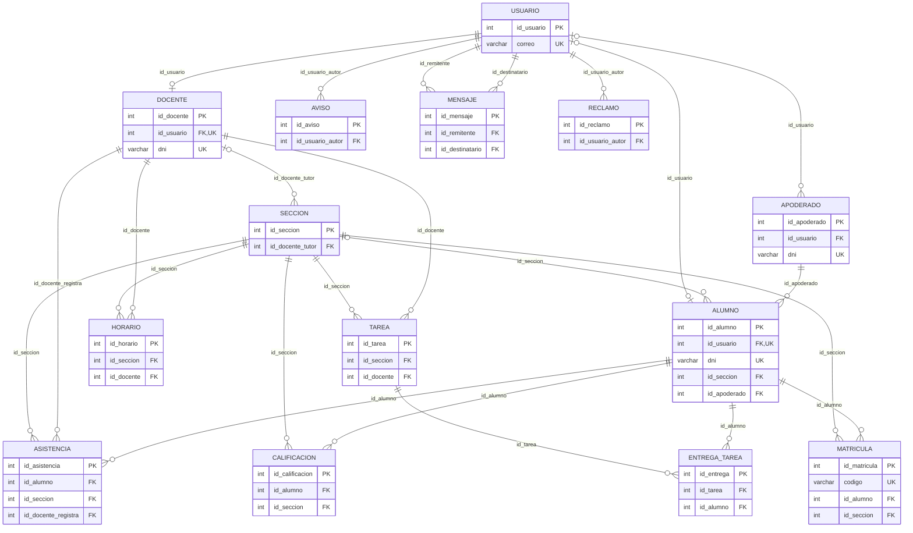

# Diccionario de datos — Academia Decam

> Generado automáticamente desde la base de datos `academia_decam` con `npm run docs:db`. No lo edites a mano: cambia los `COMMENT` de `database/schema.sql` y vuelve a generarlo.

**Motor:** MySQL 8 · InnoDB · utf8mb4 · **14 tablas**, 106 columnas, 23 llaves foráneas, 14 reglas CHECK.

## Contenido

- **1. Personas y acceso:** [`usuario`](#usuario) · [`docente`](#docente) · [`apoderado`](#apoderado)
- **2. Organización académica:** [`seccion`](#seccion) · [`alumno`](#alumno) · [`matricula`](#matricula) · [`horario`](#horario)
- **3. Gestión académica:** [`calificacion`](#calificacion) · [`asistencia`](#asistencia) · [`tarea`](#tarea) · [`entrega_tarea`](#entrega_tarea)
- **4. Comunicación:** [`reclamo`](#reclamo) · [`aviso`](#aviso) · [`mensaje`](#mensaje)
- [Diagrama entidad-relación](#diagrama-entidad-relación)

## Tablas

### 1. Personas y acceso

#### usuario

_Cuenta de acceso de toda persona que entra al sistema (los 4 roles)_

| Campo | Tipo | Nulo | Clave | Por defecto | Descripción |
|---|---|---|---|---|---|
| `id_usuario` | `int` | No | PK | AUTO_INCREMENT | Identificador único del usuario |
| `nombre` | `varchar(60)` | No | — | — | Nombres de la persona |
| `apellido` | `varchar(60)` | No | — | — | Apellidos de la persona |
| `correo` | `varchar(100)` | No | UQ | — | Correo institucional; se usa para iniciar sesión (HU-001) |
| `contrasena_hash` | `varchar(255)` | No | — | — | Contraseña cifrada con bcrypt (costo 10); nunca se guarda en texto plano (RNF-02) |
| `rol` | `enum('docente','alumno','jefe_academico','registrador')` | No | — | — | Rol que define los módulos a los que accede el usuario (HU-001) |
| `estado` | `enum('activo','inactivo')` | No | — | activo | activo = puede iniciar sesión; inactivo = acceso suspendido |
| `fecha_registro` | `datetime` | No | — | CURRENT_TIMESTAMP | Fecha y hora en que se creó la cuenta |
| `intentos_fallidos` | `tinyint unsigned` | No | — | 0 | Intentos de inicio de sesión fallidos seguidos; se reinicia al acertar o al bloquear (RNF-02) |
| `bloqueado_hasta` | `datetime` | Sí | — | NULL | Si es una fecha futura, la cuenta está bloqueada hasta ese momento (RNF-02) |

**Restricciones e índices**

- **Única** `uq_usuario_correo`: (correo)
- **Verificación** `chk_usuario_correo`: `regexp_like(correo,'^[^@ ]+@[^@ ]+[.][^@ ]+$')`
- **Verificación** `chk_usuario_intentos`: `(intentos_fallidos <= 5)`
- **Índice** `idx_usuario_rol_estado`: (rol, estado)

#### docente

_Perfil del usuario con rol docente_

| Campo | Tipo | Nulo | Clave | Por defecto | Descripción |
|---|---|---|---|---|---|
| `id_docente` | `int` | No | PK | AUTO_INCREMENT | Identificador único del docente |
| `id_usuario` | `int` | No | FK, UQ | — | Cuenta de acceso del docente (un usuario es a lo sumo un docente) |
| `dni` | `varchar(8)` | No | UQ | — | Documento de identidad: exactamente 8 dígitos |
| `especialidad` | `varchar(80)` | Sí | — | NULL | Área o curso en que se especializa |
| `telefono` | `varchar(15)` | Sí | — | NULL | Teléfono de contacto |

**Restricciones e índices**

- **Clave foránea** `fk_docente_usuario`: `id_usuario` → `usuario(id_usuario)` · ON UPDATE CASCADE, ON DELETE RESTRICT
- **Única** `uq_docente_dni`: (dni)
- **Única** `uq_docente_usuario`: (id_usuario)
- **Verificación** `chk_docente_dni`: `regexp_like(dni,'^[0-9]{8}$')`

#### apoderado

_Responsable legal de uno o más alumnos_

| Campo | Tipo | Nulo | Clave | Por defecto | Descripción |
|---|---|---|---|---|---|
| `id_apoderado` | `int` | No | PK | AUTO_INCREMENT | Identificador único del apoderado |
| `id_usuario` | `int` | Sí | FK | NULL | Cuenta de acceso, si el apoderado tiene una (no es obligatoria) |
| `dni` | `varchar(8)` | No | UQ | — | Documento de identidad: exactamente 8 dígitos |
| `nombre_completo` | `varchar(120)` | No | — | — | Nombres y apellidos del apoderado |
| `telefono` | `varchar(15)` | No | — | — | Teléfono de contacto |
| `direccion` | `varchar(150)` | Sí | — | NULL | Domicilio del apoderado |
| `correo` | `varchar(100)` | Sí | — | NULL | Correo de contacto (lo pide el formulario de matrícula, HU-003) |
| `fecha_registro` | `datetime` | No | — | CURRENT_TIMESTAMP | Fecha en que se registró (el listado de Registro la muestra, HU-002 CA-001) |

**Restricciones e índices**

- **Clave foránea** `fk_apoderado_usuario`: `id_usuario` → `usuario(id_usuario)` · ON UPDATE CASCADE, ON DELETE SET NULL
- **Única** `uq_apoderado_dni`: (dni)
- **Verificación** `chk_apoderado_correo`: `((correo is null) or regexp_like(correo,'^[^@ ]+@[^@ ]+[.][^@ ]+$'))`
- **Verificación** `chk_apoderado_dni`: `regexp_like(dni,'^[0-9]{8}$')`

### 2. Organización académica

#### seccion

_Grupo de alumnos de un grado, letra y año lectivo (p. ej. 6.° A de Primaria)_

| Campo | Tipo | Nulo | Clave | Por defecto | Descripción |
|---|---|---|---|---|---|
| `id_seccion` | `int` | No | PK | AUTO_INCREMENT | Identificador único de la sección |
| `nivel` | `enum('Primaria','Secundaria')` | No | — | — | Nivel educativo |
| `grado` | `tinyint` | No | — | — | Grado: 1 a 6 en Primaria, 1 a 5 en Secundaria (HU-003 CA-002) |
| `letra` | `char(1)` | No | — | — | Letra de la sección (A, B, C...) |
| `turno` | `enum('Mañana','Tarde')` | No | — | — | Turno en que se dictan las clases |
| `aula` | `varchar(20)` | Sí | — | NULL | Aula asignada |
| `id_docente_tutor` | `int` | Sí | FK | NULL | Docente tutor de la sección |
| `anio_lectivo` | `year` | No | — | — | Año lectivo al que pertenece la sección |

**Restricciones e índices**

- **Clave foránea** `fk_seccion_tutor`: `id_docente_tutor` → `docente(id_docente)` · ON UPDATE CASCADE, ON DELETE SET NULL
- **Única** `uq_seccion`: (nivel, grado, letra, anio_lectivo)
- **Verificación** `chk_seccion_grado`: `(((nivel = 'Primaria') and (grado between 1 and 6)) or ((nivel = 'Secundaria') and (grado between 1 and 5)))`
- **Verificación** `chk_seccion_letra`: `regexp_like(letra,'^[A-Z]$')`

#### alumno

_Estudiante del colegio (HU-002)_

| Campo | Tipo | Nulo | Clave | Por defecto | Descripción |
|---|---|---|---|---|---|
| `id_alumno` | `int` | No | PK | AUTO_INCREMENT | Identificador único del alumno |
| `id_usuario` | `int` | Sí | FK, UQ | NULL | Cuenta de acceso del alumno (un usuario es a lo sumo un alumno) |
| `dni` | `varchar(8)` | No | UQ | — | Documento de identidad: exactamente 8 dígitos |
| `fecha_nacimiento` | `date` | No | — | — | Fecha de nacimiento |
| `sexo` | `enum('M','F')` | No | — | — | M = masculino, F = femenino |
| `direccion` | `varchar(150)` | Sí | — | NULL | Domicilio del alumno |
| `nivel` | `enum('Primaria','Secundaria')` | No | — | — | Nivel educativo en que está registrado |
| `id_seccion` | `int` | Sí | FK | NULL | Sección en la que está matriculado actualmente |
| `id_apoderado` | `int` | No | FK | — | Apoderado responsable del alumno |
| `estado` | `enum('activo','inactivo','egresado')` | No | — | activo | activo = estudia actualmente; inactivo = retirado o suspendido; egresado = terminó el colegio |

**Restricciones e índices**

- **Clave foránea** `fk_alumno_apoderado`: `id_apoderado` → `apoderado(id_apoderado)` · ON UPDATE CASCADE, ON DELETE RESTRICT
- **Clave foránea** `fk_alumno_seccion`: `id_seccion` → `seccion(id_seccion)` · ON UPDATE CASCADE, ON DELETE SET NULL
- **Clave foránea** `fk_alumno_usuario`: `id_usuario` → `usuario(id_usuario)` · ON UPDATE CASCADE, ON DELETE SET NULL
- **Única** `uq_alumno_dni`: (dni)
- **Única** `uq_alumno_usuario`: (id_usuario)
- **Verificación** `chk_alumno_dni`: `regexp_like(dni,'^[0-9]{8}$')`
- **Índice** `idx_alumno_seccion_estado`: (id_seccion, estado)

#### matricula

_Inscripción de un alumno en una sección durante un año lectivo (una por alumno y año)_

| Campo | Tipo | Nulo | Clave | Por defecto | Descripción |
|---|---|---|---|---|---|
| `id_matricula` | `int` | No | PK | AUTO_INCREMENT | Identificador único de la matrícula |
| `codigo` | `varchar(10)` | No | UQ | — | Código correlativo único con formato MAT-0001 (HU-003 CA-001) |
| `id_alumno` | `int` | No | FK | — | Alumno matriculado |
| `id_seccion` | `int` | No | FK | — | Sección en la que se matricula |
| `anio_lectivo` | `year` | No | — | — | Año lectivo de la matrícula |
| `fecha_matricula` | `date` | No | — | — | Fecha en que se registró la matrícula |
| `estado` | `enum('activa','inactiva')` | No | — | activa | activa = vigente; inactiva = anulada o retirada (HU-004 CA-002) |
| `procedencia` | `enum('nuevo','traslado','promocion')` | No | — | nuevo | Alumno nuevo, traslado de otro colegio o promoción interna (formulario de matrícula, HU-003) |
| `observaciones` | `varchar(200)` | Sí | — | NULL | Notas libres: procedencia, motivo de retiro, etc. |

**Restricciones e índices**

- **Clave foránea** `fk_matricula_alumno`: `id_alumno` → `alumno(id_alumno)` · ON UPDATE CASCADE, ON DELETE RESTRICT
- **Clave foránea** `fk_matricula_seccion`: `id_seccion` → `seccion(id_seccion)` · ON UPDATE CASCADE, ON DELETE RESTRICT
- **Única** `uq_matricula_alumno_anio`: (id_alumno, anio_lectivo)
- **Única** `uq_matricula_codigo`: (codigo)
- **Verificación** `chk_matricula_codigo`: `regexp_like(codigo,'^MAT-[0-9]{4,6}$')`
- **Índice** `idx_matricula_seccion_estado`: (id_seccion, estado)

#### horario

_Bloque semanal de clases; una sección no puede tener dos clases a la vez ni un docente estar en dos aulas_

| Campo | Tipo | Nulo | Clave | Por defecto | Descripción |
|---|---|---|---|---|---|
| `id_horario` | `int` | No | PK | AUTO_INCREMENT | Identificador único del bloque horario |
| `id_seccion` | `int` | No | FK | — | Sección que recibe la clase |
| `dia_semana` | `enum('Lunes','Martes','Miercoles','Jueves','Viernes')` | No | — | — | Día de la semana |
| `hora_inicio` | `time` | No | — | — | Hora en que empieza la clase |
| `hora_fin` | `time` | No | — | — | Hora en que termina la clase |
| `curso` | `varchar(60)` | No | — | — | Curso que se dicta en el bloque |
| `id_docente` | `int` | No | FK | — | Docente que dicta la clase |

**Restricciones e índices**

- **Clave foránea** `fk_horario_docente`: `id_docente` → `docente(id_docente)` · ON UPDATE CASCADE, ON DELETE RESTRICT
- **Clave foránea** `fk_horario_seccion`: `id_seccion` → `seccion(id_seccion)` · ON UPDATE CASCADE, ON DELETE RESTRICT
- **Única** `uq_horario_docente_bloque`: (id_docente, dia_semana, hora_inicio)
- **Única** `uq_horario_seccion_bloque`: (id_seccion, dia_semana, hora_inicio)
- **Verificación** `chk_horario_horas`: `(hora_fin > hora_inicio)`

### 3. Gestión académica

#### calificacion

_Notas de un alumno en una sección y periodo (HU-005, HU-007)_

| Campo | Tipo | Nulo | Clave | Por defecto | Descripción |
|---|---|---|---|---|---|
| `id_calificacion` | `int` | No | PK | AUTO_INCREMENT | Identificador único del registro de notas |
| `id_alumno` | `int` | No | FK | — | Alumno calificado |
| `id_seccion` | `int` | No | FK | — | Sección en la que se registran las notas |
| `examen1` | `decimal(4,2)` | Sí | — | NULL | Nota del examen 1 (0 a 20); NULL = aún no registrada |
| `examen2` | `decimal(4,2)` | Sí | — | NULL | Nota del examen 2 (0 a 20); NULL = aún no registrada |
| `tareas` | `decimal(4,2)` | Sí | — | NULL | Nota de tareas (0 a 20); NULL = aún no registrada |
| `proyecto` | `decimal(4,2)` | Sí | — | NULL | Nota del proyecto (0 a 20); NULL = aún no registrada |
| `promedio` | `decimal(4,2)` | Sí | — | NULL | Promedio de las notas registradas, con 2 decimales; Aprobado desde 11.00 (HU-005 CA-001) |
| `periodo` | `varchar(20)` | No | — | — | Periodo académico (Bimestre I a IV) |

**Restricciones e índices**

- **Clave foránea** `fk_calificacion_alumno`: `id_alumno` → `alumno(id_alumno)` · ON UPDATE CASCADE, ON DELETE RESTRICT
- **Clave foránea** `fk_calificacion_seccion`: `id_seccion` → `seccion(id_seccion)` · ON UPDATE CASCADE, ON DELETE RESTRICT
- **Única** `uq_calificacion`: (id_alumno, id_seccion, periodo)
- **Verificación** `chk_calificacion_notas`: `(((examen1 is null) or (examen1 between 0 and 20)) and ((examen2 is null) or (examen2 between 0 and 20)) and ((tareas is null) or (tareas between 0 and 20)) and ((proyecto is null) or (proyecto between 0 and 20)) and ((promedio is null) or (promedio between 0 and 20)))`
- **Verificación** `chk_calificacion_periodo`: `(periodo in ('Bimestre I','Bimestre II','Bimestre III','Bimestre IV'))`
- **Índice** `idx_calificacion_seccion_periodo`: (id_seccion, periodo)

#### asistencia

_Asistencia diaria de un alumno (HU-008, HU-009); un registro por alumno, sección y día_

| Campo | Tipo | Nulo | Clave | Por defecto | Descripción |
|---|---|---|---|---|---|
| `id_asistencia` | `int` | No | PK | AUTO_INCREMENT | Identificador único del registro de asistencia |
| `id_alumno` | `int` | No | FK | — | Alumno al que se le toma asistencia |
| `id_seccion` | `int` | No | FK | — | Sección en la que se pasa lista |
| `fecha` | `date` | No | — | — | Día de la asistencia |
| `estado` | `enum('presente','ausente','tardanza')` | No | — | — | Asistencia del alumno ese día; la tardanza cuenta como asistencia |
| `id_docente_registra` | `int` | No | FK | — | Docente que pasó la lista |

**Restricciones e índices**

- **Clave foránea** `fk_asistencia_alumno`: `id_alumno` → `alumno(id_alumno)` · ON UPDATE CASCADE, ON DELETE RESTRICT
- **Clave foránea** `fk_asistencia_docente`: `id_docente_registra` → `docente(id_docente)` · ON UPDATE CASCADE, ON DELETE RESTRICT
- **Clave foránea** `fk_asistencia_seccion`: `id_seccion` → `seccion(id_seccion)` · ON UPDATE CASCADE, ON DELETE RESTRICT
- **Única** `uq_asistencia`: (id_alumno, id_seccion, fecha)
- **Índice** `idx_asistencia_seccion_fecha`: (id_seccion, fecha)

#### tarea

_Tarea, examen, proyecto o exposición asignado a una sección (HU-010)_

| Campo | Tipo | Nulo | Clave | Por defecto | Descripción |
|---|---|---|---|---|---|
| `id_tarea` | `int` | No | PK | AUTO_INCREMENT | Identificador único de la tarea |
| `titulo` | `varchar(100)` | No | — | — | Título de la tarea o evaluación |
| `descripcion` | `varchar(300)` | Sí | — | NULL | Indicaciones para los alumnos |
| `tipo` | `enum('Tarea','Examen','Proyecto','Exposición')` | No | — | Tarea | Clase de actividad (HU-010) |
| `id_seccion` | `int` | No | FK | — | Sección a la que se asigna |
| `id_docente` | `int` | No | FK | — | Docente que la publica |
| `fecha_asignacion` | `date` | No | — | — | Día en que se publicó |
| `fecha_entrega` | `date` | No | — | — | Fecha límite de entrega |

**Restricciones e índices**

- **Clave foránea** `fk_tarea_docente`: `id_docente` → `docente(id_docente)` · ON UPDATE CASCADE, ON DELETE RESTRICT
- **Clave foránea** `fk_tarea_seccion`: `id_seccion` → `seccion(id_seccion)` · ON UPDATE CASCADE, ON DELETE RESTRICT
- **Índice** `idx_tarea_seccion_entrega`: (id_seccion, fecha_entrega)

#### entrega_tarea

_Cumplimiento de una tarea por un alumno (HU-010)_

| Campo | Tipo | Nulo | Clave | Por defecto | Descripción |
|---|---|---|---|---|---|
| `id_entrega` | `int` | No | PK | AUTO_INCREMENT | Identificador único de la entrega |
| `id_tarea` | `int` | No | FK | — | Tarea a la que corresponde |
| `id_alumno` | `int` | No | FK | — | Alumno que entrega |
| `estado` | `enum('pendiente','entregada','atrasada')` | No | — | pendiente | pendiente = en plazo y sin entregar; entregada = ya entregada; atrasada = venció sin entregar |
| `fecha_entrega_real` | `datetime` | Sí | — | NULL | Momento en que el alumno entregó; obligatorio si el estado es entregada |
| `comentario` | `varchar(200)` | Sí | — | NULL | Observación del alumno o del docente |

**Restricciones e índices**

- **Clave foránea** `fk_entrega_alumno`: `id_alumno` → `alumno(id_alumno)` · ON UPDATE CASCADE, ON DELETE RESTRICT
- **Clave foránea** `fk_entrega_tarea`: `id_tarea` → `tarea(id_tarea)` · ON UPDATE CASCADE, ON DELETE RESTRICT
- **Única** `uq_entrega`: (id_tarea, id_alumno)
- **Verificación** `chk_entrega_fecha_real`: `((estado <> 'entregada') or (fecha_entrega_real is not null))`

### 4. Comunicación

#### reclamo

_Reclamo académico o administrativo (HU-011)_

| Campo | Tipo | Nulo | Clave | Por defecto | Descripción |
|---|---|---|---|---|---|
| `id_reclamo` | `int` | No | PK | AUTO_INCREMENT | Identificador único del reclamo |
| `id_usuario_autor` | `int` | No | FK | — | Usuario que registra el reclamo (HU-011 CA-001) |
| `asunto` | `varchar(120)` | No | — | — | Resumen del reclamo (obligatorio, HU-011 CA-002) |
| `tipo` | `varchar(50)` | No | — | — | Categoría: calificacion, asistencia, trato, administrativo u otro |
| `prioridad` | `enum('normal','alta','urgente')` | No | — | normal | Urgencia con que debe atenderse |
| `descripcion` | `varchar(500)` | No | — | — | Detalle del reclamo (obligatorio, HU-011 CA-002) |
| `estado` | `enum('pendiente','revision','resuelto')` | No | — | pendiente | Avanza pendiente, revision y resuelto; solo lo cambia el Jefe Académico (HU-011 CA-003) |
| `fecha_registro` | `datetime` | No | — | CURRENT_TIMESTAMP | Fecha y hora en que se registró |

**Restricciones e índices**

- **Clave foránea** `fk_reclamo_autor`: `id_usuario_autor` → `usuario(id_usuario)` · ON UPDATE CASCADE, ON DELETE RESTRICT
- **Verificación** `chk_reclamo_tipo`: `(tipo in ('calificacion','asistencia','trato','administrativo','otro'))`
- **Índice** `idx_reclamo_estado_prioridad`: (estado, prioridad)
- **Índice** `idx_reclamo_fecha`: (fecha_registro)

#### aviso

_Comunicado institucional (HU-012)_

| Campo | Tipo | Nulo | Clave | Por defecto | Descripción |
|---|---|---|---|---|---|
| `id_aviso` | `int` | No | PK | AUTO_INCREMENT | Identificador único del aviso |
| `titulo` | `varchar(120)` | No | — | — | Título del aviso |
| `contenido` | `varchar(500)` | No | — | — | Texto del aviso |
| `id_usuario_autor` | `int` | No | FK | — | Usuario que lo publica; solo el Jefe Académico (RF-12) |
| `fecha_publicacion` | `datetime` | No | — | CURRENT_TIMESTAMP | Fecha y hora de publicación (HU-012 CA-001) |
| `destinatarios` | `enum('todos','docentes','alumnos')` | No | — | todos | Quiénes deben verlo |

**Restricciones e índices**

- **Clave foránea** `fk_aviso_autor`: `id_usuario_autor` → `usuario(id_usuario)` · ON UPDATE CASCADE, ON DELETE RESTRICT
- **Índice** `idx_aviso_fecha`: (fecha_publicacion)

#### mensaje

_Mensaje directo entre dos usuarios_

| Campo | Tipo | Nulo | Clave | Por defecto | Descripción |
|---|---|---|---|---|---|
| `id_mensaje` | `int` | No | PK | AUTO_INCREMENT | Identificador único del mensaje |
| `id_remitente` | `int` | No | FK | — | Usuario que envía |
| `id_destinatario` | `int` | No | FK | — | Usuario que recibe |
| `contenido` | `varchar(1000)` | No | — | — | Texto del mensaje |
| `fecha_envio` | `datetime` | No | — | CURRENT_TIMESTAMP | Fecha y hora de envío |
| `leido` | `tinyint(1)` | No | — | 0 | TRUE cuando el destinatario ya lo abrió |

**Restricciones e índices**

- **Clave foránea** `fk_mensaje_destinatario`: `id_destinatario` → `usuario(id_usuario)` · ON UPDATE CASCADE, ON DELETE RESTRICT
- **Clave foránea** `fk_mensaje_remitente`: `id_remitente` → `usuario(id_usuario)` · ON UPDATE CASCADE, ON DELETE RESTRICT
- **Índice** `idx_mensaje_bandeja`: (id_destinatario, leido, fecha_envio)

## Diagrama entidad-relación

_En el diagrama solo se muestran las columnas clave (PK, FK y únicas); el detalle de cada tabla está arriba._
